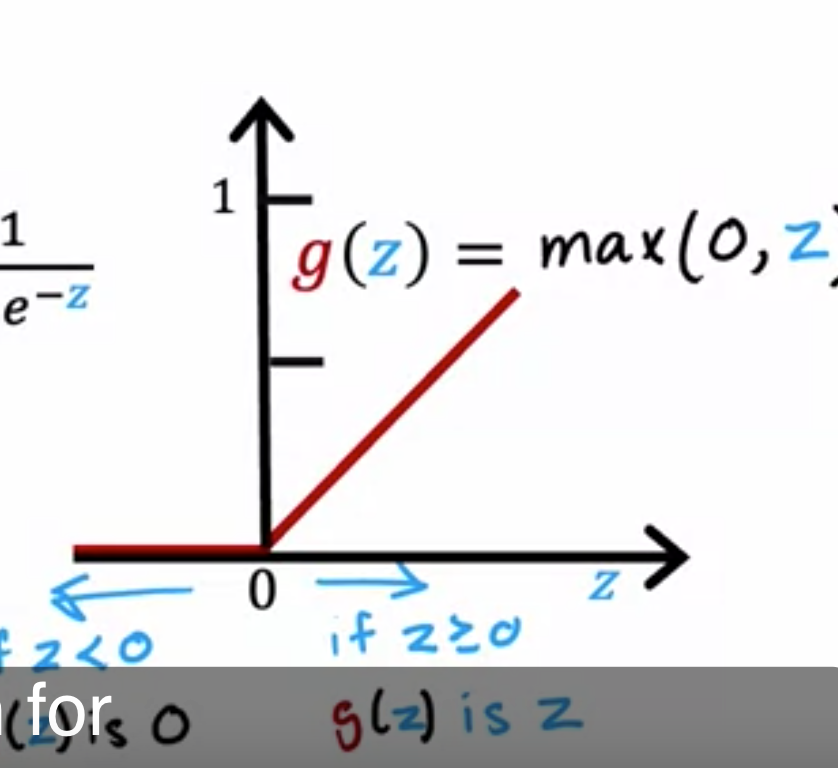

# Activation Functions 

## Alternatives to the sigmoid activation

- 이때까지 activation function 으로는 sigmoid 만 사용했는데 다른 activation function 을 쓰면 더 neural network 의 성능이 더 좋아질 수 있다.
  - 여기서는 sigmoid 보다 ReLU 가 더 적합한 상황을 소개해주고, 여러 activation function 을 소개해주고 끝. 
- Neural Network 에서 쓰는 activation function 으로는 ReLU 라는 함수를 쓴다.
  - 일단 이 함수는 1 과 0 이 아니라 더 큰 양수 범위까지 내놓을 수 있다는 듯.
  - 왜 이걸 쓰지? 이게 더 성능이 좋으니까 쓸텐데..  
    - sigmoid 는 이진 분류에 적합.
    - sigmoid 는 0이나 1에 가까워지면 경사 소실 (gradient vanishing) 의 문제가 생길 수 있다고함. ReLU 는 이게 없다고함.
    - ReLU 는 음수가 나오면 0으로 나오기 떄문에 일부 뉴런이 학습에 기여하지 않는 문제가 있다고 함. 
    - ReLU 는 계산이 간단하고 (지수 함수보단), 학습이 빠르고 경사 소실 문제가 없음.
  - g(z) = max(0, z)
    - 0 보다 작으면 0 을 출력하고, 0 보다 크거나 같은 경우에는 그 값을 그대로 이용.

- 이 activation function 말고도 선형 활성화 함수, 소프트 맥스 활성화 함수라는 것도 있다는 듯.
  - 선형 활성화 함수는 g(z) = z 로, 간단한 신경망에서 쓴다.
  - 소프트 맥스 활성화 함수는 주로 출력층에서 다중 클래스 분류를 하기 위해서 쓰인다. 
    - 입력 값들을 확률 분포로 변환해서 어떤 클래스에 속할지를 확률로 결정.
    - g(z)_i = exp(z_i) / sum(exp(z_j)
  - ReLU 는 주로 hidden layer 에서 선호됨.

- 경사 소실 (gradient vanishing)
  - neural network 학습할 때 발생하는 문제. 특히 깊은 hidden layer 에서 문제가 더 생김.
  - backpropagation 에서 기울기 계산을 할 때 너무 작게 나와서 파라미터들의 업데이트가 거의 되지 않는 문제.
    - 이로 인해서 신경막 학습이 제대로 안되거나 느려지는 문제가 생김.
  - 이유는 sigmoid 의 함수는 0과 1의 값이고, 이로 인해서 미분의 최대값또한 0.25 로 작다. 근데 이 값이 backpropagation 과정을 계속 곱해지면서 점점 더 작아진다고 함.

- 예기서는 인식 (awareness) 가 단순히 0과 1의 문제가 아니라, 그 사이에 여러 정도나 등급이 있다고 하고 이 경우에는 sigmoid 는 적합하지 않을 수 있다고 함.
  - 그리고 인식 같은 경우는 음수도 될 수 없고.

- ReLU (Rectified Linear Unit) function 의 모양 

- 여러 종류의 activation function 들.

- Linear activation function 을 쓴다는 건 다른 activation function 을 쓰기 싫다는 뜻. 
  - 정의만 보면 맞네. g(z) = z 니까 그대로 나오니까.
  - 전형적인 회귀함수 그자체.
- 이것 말고도 softmax function 도 있음.

## Choosing activation functions

- output layer 와 hidden layer 에서 activation function 을 선택하는 방법을 다룬다.
- output layer 의 activation function 은 출력 결과에 따라서 결정된다.
  - 이진 분류라면 sigmoid 를 
  - 회귀 문제라면 linear activation function 을 (양수 or 음수가 될 수 있다면)
  - 음수가 아닌 값으로 예측하는 문제라면 ReLU 를 사용한다.
- hidden layer 에서는 ReLU 가 가장 보편적이다.
  - 이는 계산 속도와 학습 속도 떄문이다.
    - 학습 속도가 중요한 요인. 
    - sigmoid function 은 flat 한 부분이 두 군데가 있는데 1과 가까운 부분, 0과 가까운 부분. 이 경우에 gradient descent 가 매우매우 느려진다.
  - sigmoid 는 잘안쓰인다. output layer 말고.
- 다양한 activation function 을 알고 있는 것은 중요하다.

- 실제로 어떻게 쓰는지. 

- 이것외에도 또 다양한 activation function 이 있고 저자는 LeakyReLU function 이 아주 약간 ReLU function 보다 낫다고한다. 
- 대부분의 상황에선 ReLU 만으로 충분하다고 하네.

## Why do we need activation functions?

- activation function 이 필요한 이유로 linear activation function 만 적용할 경우 그냥 선형 회귀와 별반 다른게 없어서.
- 더 복잡한 패턴을 파악하기 위해서 다양한 activation function 을 쓴다.

- 그래서 일반적으로 hidden layer 에서는 linear activation function 을 쓰지 않는게 좋다.
  - 선형 활성화 함수를 쓰게되면 각 layer 에서 선형 변환만이 이뤄어져서 모든 층이 결합될 때 최종적으로 단순한 선형 함수가 되기 때문에.
  - 이걸만나면 선형으로 가게되네..

- linear activation function 을 쓰면 왜 효과가 없는지 설명하는 부분. 
  - 그냥 wx + b 와 다를 바 없어서. 
- (여기서 좀 아이디어를 얻었는데 activation function 을 다른 걸로 쓴 neural network 에서 layer 를 타고 가면 복잡한 함수를 이루겠다. 그래서 복잡한 패턴을 추론할 수 있겠다. 라는 생각이듦) 

