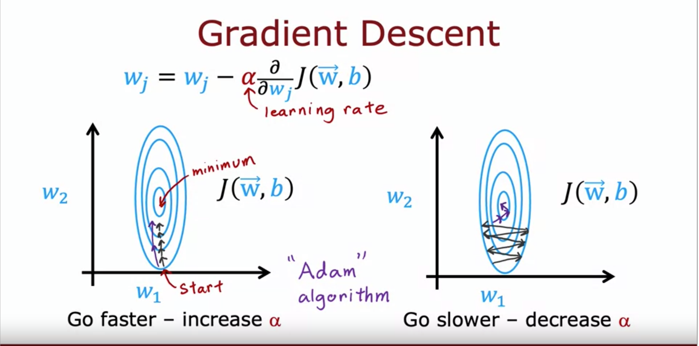

# Additional Neural Network Concepts

## Advanced Optimization

- gradient descent 를 대체할 수 있는 Adam (Adaptive Moment estimation) 알고리즘을 소개.
- Adam 은 learning rate 를 자동으로 조절해서 gradient descent 보다 빠르게 학습할 수 있다.
- Adam 을 코드로도 어떻게 구현할 수 있는지도 알려줌.
  - 이 알고리즘도 초기 learning rate 를 설정해줘야하지만 자동으로 조절해주기 때문에 robustness 가 향상된다. 
  - robustness: AI/ML 에서 사용되는 개념으로 다양한 상황과 변동에도 잘 견디는 특성을 말한다.
    - Robust 한 모델은 이상치, 노이즈, 변경된 데이터 분포에도 성능이 그렇게 크게 변하진 않는다.

- Adam 은 하나의 global learning rate 를 쓰지 않는다.
- parameter 마다 learning rate 를 만들어서 쓴다.
- 어떻게 learning rate 를 조절하는지 보자.
  - 디테일하게 내용을 다루진 않는다.

- 코드로 보자. 
- model.compile 쪽이 변했다. 

- 추가) robustness 를 늘리는 방법 
  - 데이터 전처리
    - 데이터 정규화, 노이즈 제거, 이상치 제거를 통해서 데이터를 일관적으로 유지시키는 것.
  - feature selection
    - 중요한 feature 만 고르는 것.
  - 교차 검증 (cross-validation)
    - 데이터를 하위 집합으로 나누고 검증 데이터와 훈련 데이터를 나누는 것. 가장 일반적인 교차 검증은 k-fold cross-validation 이다.
  - 정규화 (Regularization)
    - 가중치를 제한해서 모델의 과적합을 방지하는 것.
    - L1 정규화와 L2 정규화가 있다.
    - L1 은 가중치의 절대 합을 최소화 하는 것. L2 는 가중치의 제곱 합을 최소화 하는 것.
  - 앙상블 학습 (Ensemble learning)
    - 여러개의 모델을 결합하여 예측하는 것.
    - 개별 모델의 한계가 있는 경우 성능을 올림.
    - 앙상블 기법에는 Bagging, Boosting, Stacking 이 있고 
  - 데이터 증강 (Data Augmentation)
    - 기존 데이터를 변형해서 새로운 데이터를 만드는 것. 데이터 셋의 크기를 늘려서 일반적인 성능을 올리는 법이다.

## Additional Layer Types

- 지금까지는 Dense Layer 만 살펴봤다.
  - 이전 output 이 다름 layer 의 input 으로 들어가는.
- 여기서부터는 다양한 layer 타입을 살펴봄. 이로 인해서 다양한 성질을 가지는 신경망을 구축할 수 있다.
- 예를 들어 일부 layer 에서는 Convolutional Layer 를 이용할 수 있다.
  - 이미지의 경우 전체 영역이 아니라 일부 영역만 보도록 하는 기법.
  - 이걸 쓰면 계산 속도가 더 빨라지고, 더 적은 훈련데이터와 overfitting 을 막을 수 있다.

- Convolutional layer 를 쓰면 아키텍처 적으로 많은 선택을 가져야한다.
  - 하나의 뉴런이 input 을 얼만큼 커버할까. 
  - 뉴런은 몇개여야할까.
- 여기서는 깊게 다루진 않고 이러한 다양한 layer 가 있고 유용할 수 있다는 걸 알자 라는 취지.
