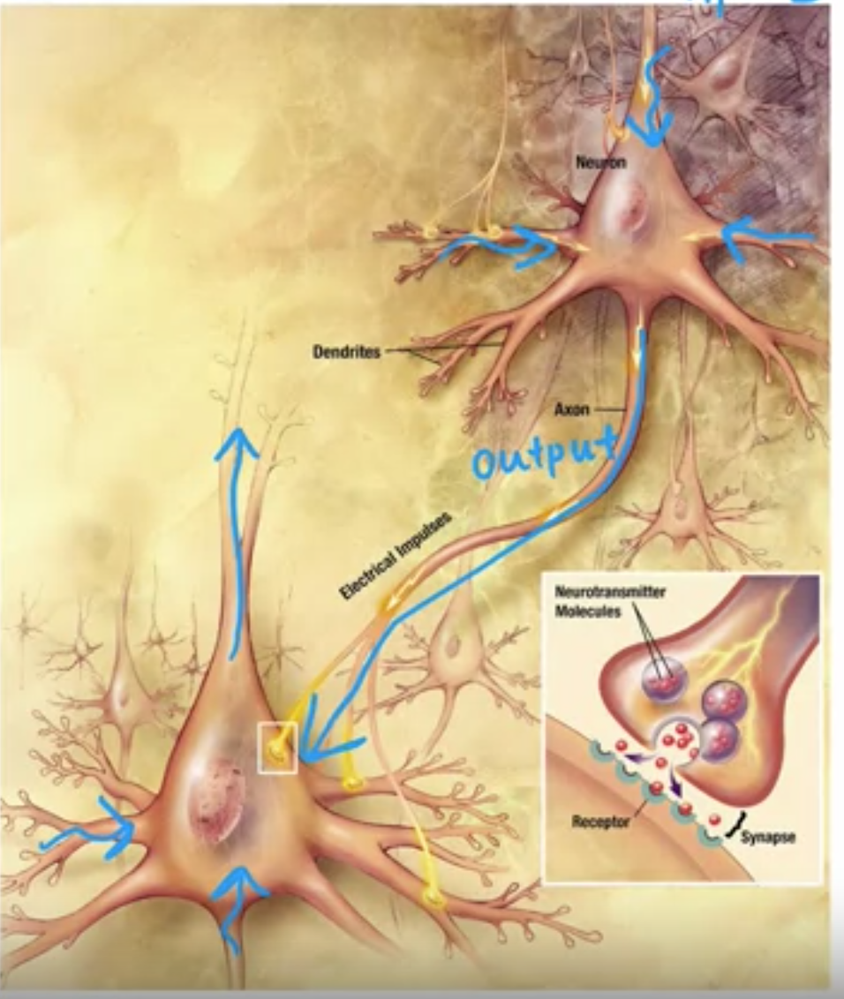

## Neural networks intuition 

- 여기서는 딥러닝 알고리즘인 Neural Networking 을 배운다. 이거랑 decision tree 배움.
- Neural network 에서 미리 train 된 parameter 를 쓴다고 함. 이렇게 쓰기도 하네. 미리 학습된 것들을 쓰는건가? 이렇게 하면 더 잘되나?
  - 전이 학습 (transfer learning) 때문에 이렇게 한다고하네.
  - 이렇게 해야 더 잘하니까. 학습 비용도 줄어들고.
  - 중요한 건 해당 학습된 신경망이 내 문제에 적합한지 확인해보는 거라고 함. 이미지 분류 작업에 학습된 신경망은 텍스트 처리 작업에는 유용하지 않기 떄문에.
  - 해당 신경망이 내가 원하는 작업에 충분한 성능을 발휘하지 못한다면 그거에 맞는 자신만의 데이터를 추가해서 파인 튜닝 (fine-tuning) 을 할 수 있다. 이렇게 하면 개발 시간도 줄이고, 리소스도 줄일 수 있다. 

## Neurons and the brain

- deep learning 과 neural network 는 같은 의미로 쓰이고 있는데 deep learning 이라는 말이 좀 더 정확하다. 말 그대로 deep, learning 이라서.
- 현재 neural network 는 뇌가 어떻게 배우는지와는 연관이 없다. 이름만 그런거임. 예전 배경이 뇌를 모방하는 작은 소프트웨어라서.

- neuron 이 어떻게 동작하는지 간단하게 설명. 여러 곳에서 input 을 받고나서 계산해서 output 만들고 이를 다른 neuron 에게 전달.
그럼 해당 neuron 은 또 여러 곳에서 input 을 받고 또 계산해서 output 을 만든 다음에 전달한다.
- 주의할 점은 아직까지 실제로 brain 이 어떻게 작동하는지 밝혀지지 않았다는 것. 그래서 인간의 원시 지능을 밝히는 것도 아직은 꽤 멀다 라는 것.

- 기존의 ML 모델인 linear regression 과 logistic regression 은 데이터를 많이 넣어도 성능 발전이 그렇게 되지는 않았는데, neural network 는 점점 Neuron 을 늘려서 많은 데이터를 학습시키니까 성능이 좋았다. 
- 이런 이유 떄문에 이 알고리즘을 쓰는 것.
- 다만 조건이 붙는다. 많은 데이터가 있어야하고, 많은 neural network 로 학습할 수 있어야한다.
- 이것 때문에 딥러닝 알고리즘이 성공했고, 프로세서와 GPU 가 발전하게 되었다. 

## Demand Prediction

- neural network 가 어떻게 작동하는지 설명.

- 어떤 티셔츠가 잘 팔릴지 (= top seller) 예측하는 것. 
- 우리가 이전에 배운 logistic regression 을 쓴다면 여기에 있는 변수인 price, shipping cost, marketing, material (제품 퀄리티) 를 써서 top seller 인지 아닌지 예측하는 것을 만들 것. 
- 딥러닝에서는 top seller 가 될 여러개의 factor 를 만들고 그것에 대해서 예측하도록 만들고 (= Neural) 그 정보를 바탕으로 top seller 인지 예측하는 것.
  - 그리고 각 factor 를 뉴런 이라고 정의한다.
  - layer 를 나눠서 진행한다는 점이 좀 다르다.

- 마지막 뉴런을 output layer 라고 한다.
- 여기서 나오는 affordability, awareness, perceived quality 를 activation 이라고한다.
  - 다음 뉴런으로 전달하는 정보를 activation 이라고함.

- 4개의 변수 -> 3개의 activation value 로 되고 -> 1개의 value 로 최종적인 output 이 나온다.

- 딥러닝은 따지자면 layer 로 나눠서 단계적으로 예측을 하는게 아닌가.

- 실제로 Neural network 를 구축할 떄 어떤 layer 에 어떤 input 들을 쓸 지 결정하는 작업은 많은 노력이 들어가기 떄문에 다음과 같이 모든 input 을 뉴런에 연결시킨다. 
이렇게 해도되는 이유는 연관이 없는 feature 의 경우에는 거의 무시할만한 수준으로 사용할 것이니까. 

- 마지막으로 input layer 에 있는 모든 feature 를 vector X 로 취급하고 이게 layer 로 간다음에 activation values 들을 낸다 이것도 vector 로 취급해서 output layer 로 전달된다.
  - 각 layer 에서 전달하는 걸 vector 로 표시.

- 용어를 좀만 더 정리하자면 처음 시작하는 layer 를 input layer, 결과를 내는 layer 를 output layer 그리고 중간에 있는 layer 들을 hidden layer 라고한다.

- 그리고 neural network 를 생각하는 방식은 이것들이 logistic regression 을 layer 마다 쓴다는 것. 각 layer 마다 feature 이 있고 output 을 확률로 내는. 
  - 더 나은 feature 로 변경되면서. feature engineering 처럼.
  - feature engineering 을 하면 더 성능이 잘나왔었다. neural networking 도 layer 를 거치면서 feature engineering 을 하니까 더 잘나오는 것. 
  - 수동인 feature engineering 이 아닌거지.

- neural network 에서 가장 큰 장점 중 하나는 hidden layer 에서 어떤 feature 를 만드는지 정의할 필요가 없다는 것. 

- neural network 에서 가장 중요한 의사결정 중 하나는 얼마나 많은 hidden layer 를 둘 것인지, 얼마나 많은 뉴런을 각 layer 에 둘 것인지이다. 이게 뉴럴 네트워크 아키텍처에 대한 질문이다. 
  - 이건 이후에 배운다고 하는듯.

- 이런 걸 Multilayer perceptron 이라고 한다. 

- Neural Network 를 정의해보자면 더 나은 feature 를 만들어 나가면서 예측을 하는 것이다. 아걸 neuron 과 layer 를 통해서 이 
  - 뉴런은 더 나은 feature 를 만드는 과정이다. (feature engineering)
  - layer 에서 계산을 해서 나온 activation value 는 logistic regression 을 통해서 만들어진다. 
  - layer 는 뉴런을 그룹화 한 것으로 같은 input 을 기반으로 만들어지는 것. 

## Example: Recognizing Images

- 이미지 인식으로 보는 각 layer 별로 뉴런이 어떤 계산을 하고 있는지 보는 것.
- 이미지 정보 자체는 픽셀 정보로 표시된다. 1000 X 1000 행렬로 1백만개의 밝기 정보가 input vector 로 들어옴.
- 각 hidden layer 가 어떤 것들을 계산하고 있는지 보면 다음과 같다. 
  - 첫 번째 hidden layer 수직선이나 수직 가장자리 같은 것들을 찾는 뉴런과 특정 방향이나 선을 찾는 뉴런 등이 있는 즉 이미지에서 매우 짧은 선을 찾는 역할을 한다면 
  - 두 번째 hidden layer 는 선들의 정보를 종합해서 얼굴의 일부인 코와 눈 같은 것들을 찾는다. 이런 일부들은 삼각형이나 사각형 모양과 같다. 각 뉴런들은 이런 모형들을 바탕으로 눈을 감지하거나 코를 감지한다.
  - 세 번째 hidden layer 는 얼굴의 종합적인 면을 보면서 판단하는 역할을 하는 뉴런이 있다. 
  - neural network 는 이러한 것들을 스스로 탐지한다는 것. 점점 high level feature 로 변경해가면서. 
  - 점점 더 큰 윈도우로 발전해나가면서 탐지한다.
  - (뉴런이 뭘 계산하려고 하는지 시각화 해보면 어떤 걸 하는지 알 수 있네.) 

- activation 은 점점 high level feature 로 되간다. 
