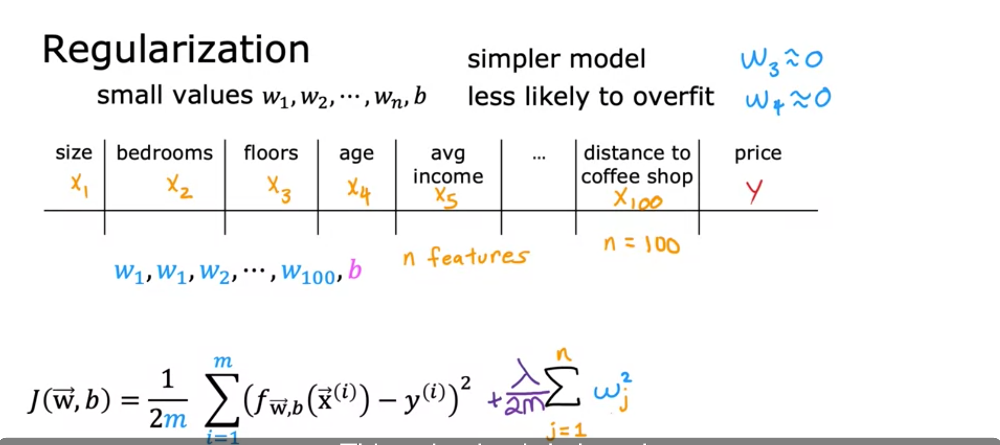

## The problem of overfitting 

- 우리가 배운 알고리즘 (= linear regression, logistic regression) 은 잘 작동하는데 overfitting 이라는 문제에 직면하기도 한다.
- 여기서는 overfitting 과 이 반대 개념인 underfitting 에 대해서 다룸.
  - 이를 regularization 으로 해결함.
- training set 에 모델이 잘 작동하지 않는 것. (= underfitting, high bias)
  - 애초에 가설 함수를 잘못 설계한 경우에 이런 케이스가 발생할 수 있음. (알고리즘이 training set 에 잘 안맞는 경우.)
- training set 에 어느정도 꽤 잘 작동하는 것. (= generalization)
- training set 에 극도로 잘 맞는 것. (= overfitting, high variance) 
  - 새로운 데이터에는 잘 안맞는 경향이 있음.
  - feature 이 너무 많은 경우에 그럴 수 있음.
- 모델을 찾을 땐 underfitting, overfitting 이 아닌 것을 찾아야한다.

## Addressing overfitting 

- option 1) 더 많은 데이터를 모아서 이상한 function 을 그리지 못하게 하는 것.

- option 2) select features to include/exclude
  - 적합한 feature 만 골라서 overfit 가 일어나지 않도록 하는 것. 
  - 너무 많은 polynomial feature + insufficient data 는 overfit 를 일으킬 수 있다.
  - 이 방식은 어쩌면 필요할 수도 있는 데이터를 버리는 것. course 2 에서는 자동적으로 predict 에 필요한 feature 를 고르는 것을 알아보겠음.

- option 3) regularization 
  - parameter 를 0 으로 줘서 feature 의 영향을 줄여서 모델의 복잡도를 줄이는 방법. (모델이 복잡할수록 overfit 하기 쉬워진다.)
  - 아니면 Parameter 자체에 값을 작게 줘서 영향을 줄이는 방법도 있음.
    - 모든 feature 를 보존하면서 과한 영향을 주는 걸 막아서 overfit 을 막는 법.
  - 이 방법은 매우 유용하다고 한다. 특히 neural network 쪽에서도. 

## Cost function with regularization

- 일반적으로 regularization 은 어떤 feature 의 파라미터가 중요한지 알지 못하기 때문에 모든 파라미터에다가 적용한다.
- 파라미터의 제곱 * 람다를 추가했기 때문에 이 오차함수를 작게 만들려면 모든 파라미터를 작도록 만들어야 한다. 그러면서 overfitting 을 막는다.
- m 으로 나눈 이유 자체는 트레이닝 셋이 커졌을 때 값도 같이 커지도록 하는 것을 막으려고.
- 파라미터 b 는 따로 영향을 안주는 이유는 딱히 영향이 없어서. 
- lambda 가 0 라면 overfitting 일 것.

- 이제 cost function 은 두가지 목적을 가진다. 트레이닝 셋에 데이러를 fit 하게 맞출려고 오차를 줄이는 것과 람다식의 값을 줄이기 위해서 파라미터를 줄이는 것. 
- 람다는 이 두가지 목적의 밸런싱을 유지해줌. 
  - 람다가 0 라면 데이터는 fit 해지고 overfitting 이 일어날 것. 
  - 람다가 10^10 이라면 모든 파라미터는 0에 가깝게 될 것. 그만큼 예측도 떨어질 여지가 있음. underfit 하게 된다. (f(x) = b 가 되버리니까.)

## Regularized linear regression

이 식을 보면 왜 gradient descent 를 한 w 파라미터의 최적화 값이 람다가 포함된 cost function 에서 w 파라미터의 값을 더 줄여주는지 알 수 있다.

## Regularized logistic regression 

- linear regression 에서 하던 것과 매우 유사함. 

